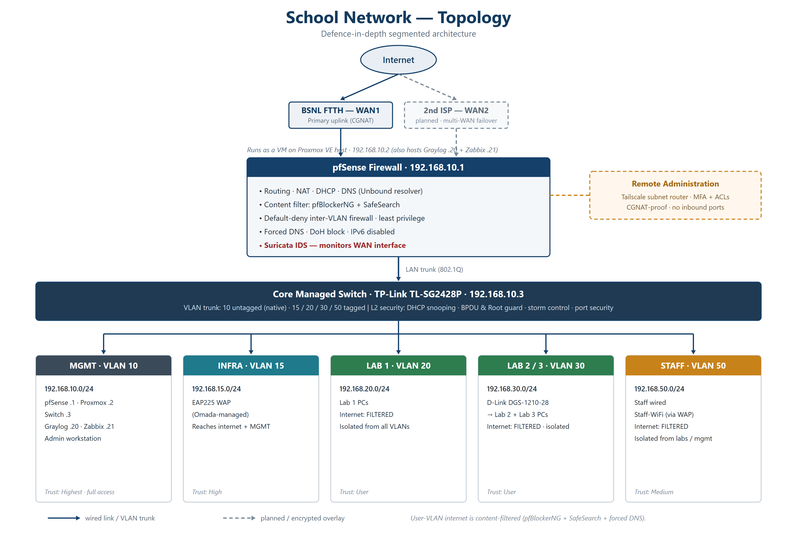
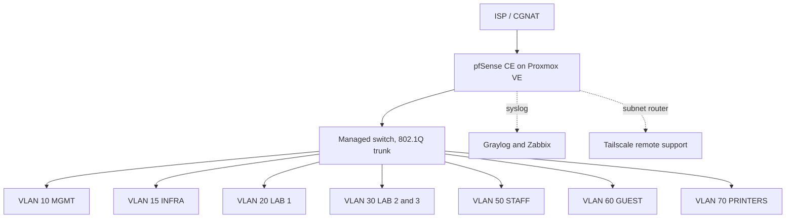

# Production-Pattern School Campus Network

Solo design, deployment and handover of a segmented, security hardened, monitored network for a private school. A paid consulting engagement: one firewall, managed switching, roughly 150 endpoints, full observability, and a clean handover with a written runbook.

> School identity and all credentials and IPs are intentionally omitted or anonymised. This repo documents architecture and decisions, not secrets. Shared with permission.

## The problem

A school running a flat network: every lab machine, staff laptop, printer and guest phone on one broadcast domain with no segmentation, no filtering, no logging and no remote support path. A single compromised student machine had line of sight to everything, and nobody could prove what had happened afterwards.

## Architecture

**7 active VLANs** carrying subnets, with an eighth tag reserved for a future lab. Default deny between segments, forced DNS with DoH blocking, WAN intrusion detection, centralised syslog and git versioned config backups.

## Why it is built this way

**Firewall as a VM, not an appliance.** pfSense runs on Proxmox rather than bare metal so the whole edge can be snapshotted before any change and rolled back in minutes. On a site with no on call engineer, a rollback path is worth more than the small performance cost.

**Forced DNS rather than a blocklist alone.** Clients cannot choose their own resolver, so DNS filtering cannot be bypassed by pointing a device at 8.8.8.8. DoH is blocked separately, because a browser that can reach DNS over HTTPS makes the filter decorative.

**Tailscale instead of inbound VPN.** The ISP is behind CGNAT, so inbound WireGuard was never going to work. A Tailscale subnet router gives remote support without a public listener, which is also one less thing to patch.

**Defence in depth, ordered by cost.** Segmentation first because it is free and structural, then DNS filtering, then IDS, then logging. Each layer assumes the one before it will eventually fail.

## Highlights

- **Layer 2 hardening:** DHCP snooping, BPDU Guard, Root Protect, storm control, port security
- **Observability:** Graylog log pipeline plus Zabbix monitoring with alerting
- **Resilience:** Oxidized config versioning and pfSense AutoConfigBackup
- **Handover:** written runbook so the school is not dependent on me

## What I built and debugged

- Diagnosed a scrambled hypervisor NIC to bridge mapping that kept severing host access
- Caught a pfSense Plus versus CE ISO trap that blocked all package installs
- Worked around ISP CGNAT, where inbound WireGuard was dead, using a Tailscale subnet router
- Traced a lab outage to a damaged copper run that had negotiated down to 100M

## Descoped on purpose

802.1X port authentication and EAP-TLS were both cut. Port based 802.1X trusts the whole port once one device authenticates, so a daisy chained hub defeats it, and full client certificate lifecycle is a full time job at school scale. PEAP with RADIUS certificate validation closes the evil twin attack at a fraction of the operational cost. Naming what you did not build, and why, is part of the design.

## Stack

Proxmox VE · pfSense CE · TP-Link Omada (EAP225) · pfBlockerNG · Suricata (WAN IDS) · Graylog · Zabbix · Oxidized · Tailscale

## Docs

- `docs/topology.png` network diagram, sanitised
- `docs/vlan-map.md` VLAN, subnet and trust zone table
- `docs/firewall-rationale.md` rule logic and the reasoning per rule
- `docs/runbook.md` handover and remote support procedure

## Skills demonstrated

Network segmentation · firewall engineering · IDS · DNS security · virtualisation · centralised logging · monitoring · config automation · documentation and handover
